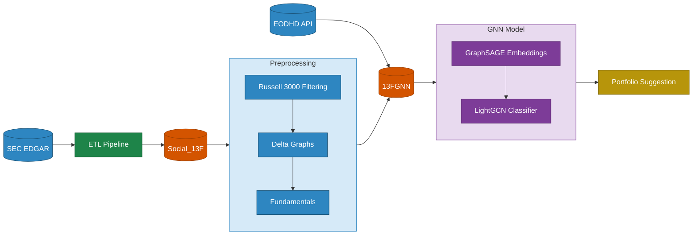

# Stock Market Social Network

A graph-based machine learning system that predicts which stocks institutional investment funds will buy in the next quarter, trained on SEC 13F filings from 2013 to present.

## Core Idea

Institutional funds that hold overlapping positions form an implicit social network. This project models that network as a bipartite graph (funds ↔ stocks), extracts graph features and embeddings (GraphSAGE), and trains a link-prediction model (LightGBM) to forecast next-quarter purchases — with strict prevention of data/time leakage.

---

## Repository Structure

```
Social-Network-Stock-Market/
│
├── Data/                        # Shared reference data
│   └── Indexes/
│       ├── RUSSELL3000 HISTORY/ # Russell 3000 index files (PDF 2013–2018, XML 2019–2025)
│       ├── Holdings_details_Russell_3000_ETF.csv
│       └── SPY.csv
│
├── ETL/                         # Stage 1 — Raw 13F ingestion
│   └── ...                      # Reads SEC EDGAR filings → Social_13F PostgreSQL DB
│
├── preprocess/                  # Stage 2 — Data preprocessing pipeline
│   ├── step1_russell3000_filtering/   # Filter holdings to valid Russell 3000 securities
│   ├── step2_delta_graphs/            # Normalized weights + quarter-over-quarter deltas
│   ├── step3_fundamental_data/        # Enrich with EODHD financial ratios
│   └── README.md                      # Full preprocessing docs
│
├── SocialNetwork/               # Stage 3 — Graph ML
│   ├── model/                   # LightGCN / GraphSAGE + LightGBM link prediction
│   └── baselines/               # Jaccard, AdamicAdar, Preferential Attachment baselines
│
├── protfolio/                   # Stage 4 — Portfolio backtesting & reporting
│
├── requirements.txt             # All project dependencies
└── .gitignore
```

---

## End-to-End Pipeline



---

## Quick Start

### 1. Prerequisites

- Python 3.10+
- PostgreSQL with `Social_13F` DB populated from ETL
- EODHD API key

### 2. Install dependencies

```bash
pip install -r requirements.txt
```

### 3. Configure environment

Create a `.env` file in the repo root:

```
DB_HOST=localhost
DB_PORT=5432
DB_USER=your_user
DB_PASSWORD=your_password
EDOHD_API=your_eodhd_api_key
```

### 4. Ingest raw 13F filings

Reads quarters from `Data/run.json` and loads them into the `Social_13F` database:

```bash
python ETL/etl_pipeline.py
```

### 5. Run preprocessing

```bash
# Step 1 – Russell 3000 filtering
python preprocess/step1_russell3000_filtering/run_full_pipeline.py

# Step 2 – Delta graphs
python preprocess/step2_delta_graphs/run_pipeline.py

# Step 3 – Fundamentals (Jupyter notebook)
# Open preprocess/step3_fundamental_data/Insert_Fundamentaldata.ipynb and run all cells
```

### 6. Train the model

```bash
python SocialNetwork/model/model/lightGCN.py
```

Optional flags:
```bash
--edges-col change_in_adjusted_weight   # edge weight column (default: change_in_weight)
--epochs 300 --embed-dim 128 --num-layers 3
--quarters 2023Q1,2023Q2                # run specific quarter pairs only
```

---

## Data Sources

| Source | What it provides |
|--------|-----------------|
| SEC EDGAR 13F | Quarterly institutional holdings (funds, CUSIPs, values) |
| Russell 3000 Index | Universe of valid US equities (2013–2025) |
| EODHD API | Historical prices, trading dates, and company fundamentals |

## Key Identifiers

| Identifier | Description | Example |
|-----------|-------------|---------|
| `CIK` | SEC fund identifier | `1325091` |
| `CUSIP` | 9-char security identifier | `037833100` |
| `TICKER` | Stock symbol | `AAPL` |

## Temporal Design

The model uses a **rolling quarter-pair** approach applied to every consecutive (Q, Q+1) pair in the dataset (2013–present):

| Component | Data used | Role |
|-----------|-----------|------|
| Input graph | Quarter Q buy-edges (Δw > 0) | Build bipartite fund-stock graph + node features |
| Target positives | Quarter Q+1 buy-edges, restricted to Q ∩ Q+1 universe | What the model learns to predict |
| 80% of Q+1 positives | — | Training (BPR loss) |
| 10% of Q+1 positives | — | Validation (early stopping, patience=25) |
| 10% of Q+1 positives | — | Test (AUC, F1, Hit@K, NDCG@K) |

**No-leakage guarantees:**
- The forward pass during training propagates only over Q's graph structure — Q+1 edges are never visible to the GNN
- Negative sampling explicitly forbids all real Q and Q+1 edges
- Stock rankings are tagged with Q+1 (the quarter being predicted, not observed)
