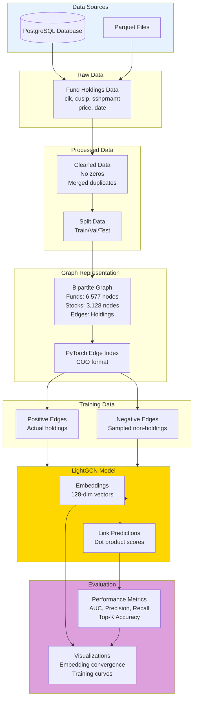

# Robust LightGCN Pipeline Architecture

This document describes the complete pipeline and model architecture for the Robust LightGCN implementation, formatted for Mermaid diagram generation.

## Pipeline Overview

The pipeline processes fund-stock holdings data to predict relationships using a Graph Convolutional Network (LightGCN) model.

## Mermaid Diagram Code

```mermaid
graph TB
    Start([Start Pipeline]) --> Config[Configuration<br/>TARGET_DATE, DATA_SOURCE<br/>HYPERPARAMETERS]
    
    Config --> Init[Initialize Device & Seeds<br/>CUDA/CPU<br/>Random Seed: 42]
    
    Init --> DataLoad{Data Source?}
    
    DataLoad -->|Database| DBLoad[Load from Database<br/>load_holdings_from_database]
    DataLoad -->|Parquet| ParquetLoad[Load from Parquet<br/>load_holdings_from_parquet]
    
    DBLoad --> Preprocess[Preprocess Data]
    ParquetLoad --> Preprocess
    
    Preprocess --> FilterZero[Filter Zero Values<br/>Remove zero holdings]
    FilterZero --> MergeDup[Merge Duplicate Rows<br/>Aggregate by fund-stock pairs]
    
    MergeDup --> Split[Split Data<br/>Train: 80%<br/>Val: 10%<br/>Test: 10%]
    
    Split --> BuildGraph[Build Bipartite Graphs<br/>NetworkX Graph<br/>Funds ↔ Stocks]
    
    BuildGraph --> GraphTrain[Training Graph<br/>G_train]
    BuildGraph --> GraphTrainVal[Train+Val Graph<br/>G_train_val]
    
    GraphTrain --> NodeMap[Create Node Mappings<br/>fund_to_idx<br/>stock_to_idx<br/>node_to_idx]
    GraphTrainVal --> NodeMap
    
    NodeMap --> PyTorch[Convert to PyTorch<br/>edge_index tensors<br/>Move to device]
    
    PyTorch --> CreatePairs[Create Training Pairs<br/>Positive edges<br/>Negative sampling]
    
    CreatePairs --> InitModel[Initialize LightGCN Model<br/>Embedding Layer<br/>GCN Layers: 3<br/>Embedding Dim: 128]
    
    InitModel --> Train[Train Model<br/>BPR Loss<br/>Adam Optimizer<br/>Early Stopping]
    
    Train --> Eval[Evaluate Model<br/>Test Set Metrics<br/>Top-K Recommendations<br/>Precision-Recall Curve]
    
    Eval --> Save{Save Model?}
    Save -->|Yes| SaveModel[Save Model Checkpoint<br/>.pth file]
    Save -->|No| Visualize
    SaveModel --> Visualize[Visualize Results<br/>Embedding Convergence<br/>Training Curves]
    
    Visualize --> End([End Pipeline])
    
    style Start fill:#90EE90
    style End fill:#FFB6C1
    style Config fill:#87CEEB
    style Train fill:#FFD700
    style Eval fill:#DDA0DD
```



## Model Architecture

```mermaid
graph LR
    subgraph Input["Input Layer"]
        Nodes[Node IDs<br/>num_nodes]
    end
    
    subgraph Embedding["Embedding Layer"]
        Emb[Embedding Matrix<br/>num_nodes × embedding_dim<br/>Initialized: N(0, 0.1)]
    end
    
    subgraph GCN["GCN Layers (3 layers)"]
        L1[GCN Layer 1<br/>GCNConv]
        L2[GCN Layer 2<br/>GCNConv]
        L3[GCN Layer 3<br/>GCNConv]
    end
    
    subgraph Aggregation["LightGCN Aggregation"]
        Stack[Stack Embeddings<br/>All layers + initial]
        Mean[Mean Pooling<br/>Average across layers]
    end
    
    subgraph Output["Output"]
        Final[Final Embeddings<br/>num_nodes × embedding_dim]
    end
    
    Nodes --> Emb
    Emb --> L1
    L1 --> L2
    L2 --> L3
    Emb --> Stack
    L1 --> Stack
    L2 --> Stack
    L3 --> Stack
    Stack --> Mean
    Mean --> Final
    
    style Embedding fill:#E6F3FF
    style GCN fill:#FFE6E6
    style Aggregation fill:#E6FFE6
    style Output fill:#FFF4E6
```

## Data Flow Diagram



## Component Details

### 1. Configuration
- **TARGET_DATE**: Date for data extraction (YYYY-MM-DD format)
- **DATA_SOURCE**: "database" or "parquet"
- **EMBEDDING_DIM**: 128 (dimension of node embeddings)
- **NUM_LAYERS**: 3 (number of GCN layers)
- **EPOCHS**: 50 (maximum training epochs)
- **LEARNING_RATE**: 0.001
- **TRAIN_RATIO**: 0.8, **VAL_RATIO**: 0.1, **TEST_RATIO**: 0.1

### 2. Data Loading
- **Database**: Loads from PostgreSQL using SQL queries filtered by date
- **Parquet**: Loads from parquet files matching the target date pattern
- **Output**: DataFrame with columns: cik, cusip, sshprnamt, price, etc.

### 3. Preprocessing
- **Filter Zero Values**: Removes rows with zero holdings
- **Merge Duplicates**: Aggregates duplicate fund-stock pairs by summing holdings

### 4. Graph Construction
- **Bipartite Graph**: NetworkX graph with two node types
  - Funds (bipartite=0): Represented by CIK identifiers
  - Stocks (bipartite=1): Represented by CUSIP identifiers
- **Edges**: Weighted edges representing holdings (weight = sshprnamt × price)

### 5. Data Splitting
- **Train Set**: 80% of edges (used for model training)
- **Validation Set**: 10% of edges (used for early stopping)
- **Test Set**: 10% of edges (used for final evaluation)
- Ensures all nodes appear in training set

### 6. Node Mappings
- **fund_to_idx**: Maps fund CIK → node index
- **stock_to_idx**: Maps stock CUSIP → node index
- **node_to_idx**: Unified mapping for all nodes
- **num_nodes**: Total number of nodes (funds + stocks)

### 7. PyTorch Conversion
- Converts NetworkX graphs to PyTorch Geometric edge_index format
- Moves tensors to appropriate device (CPU/GPU)

### 8. Training Pairs
- **Positive Pairs**: Actual fund-stock holdings from training graph
- **Negative Pairs**: Randomly sampled non-existing edges (negative sampling)
- Ratio: 1:1 positive to negative (configurable)

### 9. LightGCN Model
- **Embedding Layer**: Learnable node embeddings (num_nodes × embedding_dim)
- **GCN Layers**: 3 layers of Graph Convolutional Networks
- **Aggregation**: Mean pooling of embeddings from all layers (including initial)
- **Forward Pass**: 
  1. Get initial embeddings
  2. Propagate through GCN layers
  3. Stack all layer outputs
  4. Average to get final embeddings

### 10. Training
- **Loss Function**: Bayesian Personalized Ranking (BPR) Loss
- **Optimizer**: Adam with learning rate 0.001
- **Early Stopping**: Patience of 10 epochs
- **Validation**: Monitors validation loss on train+val graph
- **Embedding Snapshots**: Optional UMAP visualizations every N epochs

### 11. Evaluation
- **Test Set Metrics**: AUC, Precision, Recall, F1-Score
- **Top-K Recommendations**: Accuracy at K={5, 10, 20, 50}
- **Precision-Recall Curve**: Optimal threshold finding
- **Link Prediction**: Predicts fund-stock relationships

### 12. Visualization
- **Embedding Convergence**: UMAP projections showing embedding evolution
- **Training Curves**: Loss curves over epochs
- **Animated GIF**: Optional convergence animation from snapshots

## Key Functions

### Data Loading
- `load_holdings_from_database(date)`: Load from PostgreSQL
- `load_holdings_from_parquet(date, parquet_dir)`: Load from parquet files
- `load_holdings_data(date, data_source, parquet_dir)`: Unified loading interface

### Preprocessing
- `filter_zero_values(df)`: Remove zero holdings
- `merge_duplicate_rows_detailed(df)`: Aggregate duplicates
- `preprocess_data(df)`: Complete preprocessing pipeline

### Graph Operations
- `build_bipartite_graph_fastest(df)`: Build NetworkX bipartite graph
- `split_dataframe_edges(df, train_ratio, val_ratio, test_ratio)`: Split data
- `build_graphs_from_splits(train_df, val_df)`: Build train and train+val graphs
- `create_node_mappings(funds, stocks)`: Create node index mappings
- `graph_to_edge_index_fastest(G, node_to_idx, device)`: Convert to PyTorch format

### Model
- `LightGCN(num_nodes, embedding_dim, num_layers)`: Model class
- `initialize_model_fastest(...)`: Model initialization

### Training
- `bpr_loss(pos_scores, neg_scores)`: BPR loss function
- `create_positive_negative_pairs_fastest(...)`: Create training pairs
- `train_with_validation_fastest(...)`: Training loop with validation

### Evaluation
- `evaluate_test_set_fastest(...)`: Test set evaluation
- `evaluate_top_k_recommendations_fastest(...)`: Top-K metrics
- `find_optimal_threshold_fastest(...)`: PR curve and threshold optimization

### Visualization
- `generate_convergence_animation(...)`: UMAP visualization and GIF creation

## Pipeline Execution Flow

1. **Configuration** → Set parameters (date, hyperparameters, paths)
2. **Initialize** → Set device, random seeds
3. **Load Data** → From database or parquet files
4. **Preprocess** → Clean and merge data
5. **Split** → Train/validation/test split
6. **Build Graphs** → Create bipartite graphs
7. **Map Nodes** → Create index mappings
8. **Convert Format** → PyTorch tensors
9. **Create Pairs** → Positive and negative training pairs
10. **Initialize Model** → Create LightGCN instance
11. **Train** → Train with validation and early stopping
12. **Evaluate** → Test set metrics and recommendations
13. **Save** → Optional model checkpoint saving
14. **Visualize** → Embedding convergence and training curves

## Model Architecture Details

### LightGCN Forward Pass
```
Input: edge_index (graph structure)
1. x₀ = Embedding.weight  [num_nodes × embedding_dim]
2. x₁ = GCN₁(x₀, edge_index)
3. x₂ = GCN₂(x₁, edge_index)
4. x₃ = GCN₃(x₂, edge_index)
5. E = mean([x₀, x₁, x₂, x₃])  [LightGCN aggregation]
Output: E [num_nodes × embedding_dim]
```

### Link Prediction
```
For edge (u, v):
score = sigmoid(E[u] · E[v])
```

### BPR Loss
```
L = -log(σ(score_pos - score_neg))
```

## Notes for Mermaid Diagram Generation

- Copy the Mermaid code blocks above into a Mermaid-compatible editor
- The diagrams show:
  1. **Pipeline Flow**: Complete end-to-end process
  2. **Model Architecture**: Internal model structure
  3. **Data Flow**: Data transformations through the pipeline
- Customize colors and styling as needed
- Adjust node sizes and positions for better readability
