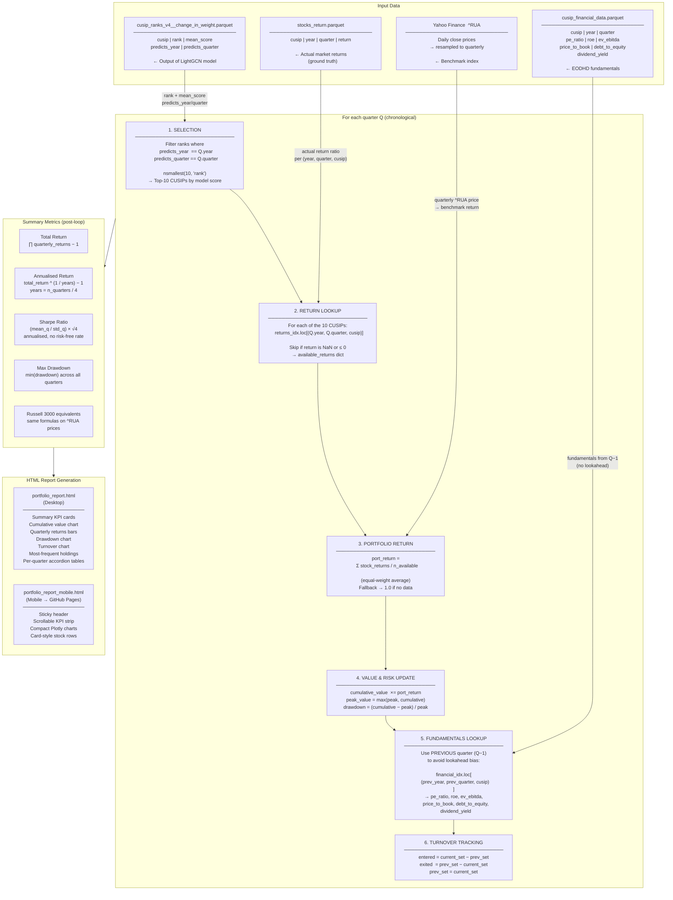

# Portfolio Backtest — Overview

This module takes the stock rankings produced by the LightGCN graph model and simulates a real investment strategy, then generates interactive HTML reports to evaluate performance.

---

## Files

| File | Purpose |
|------|---------|
| `portfolio_backtest.py` | Core algorithm — loads data, runs the backtest, computes metrics, writes HTML reports |
| `portfolio_report.html` | Desktop report generated by the script (interactive charts + per-quarter tables) |
| `portfolio_report_mobile.html` | Mobile-optimised version of the same report (deployed to GitHub Pages) |

---

## Input Data

| File | Content |
|------|---------|
| `data/cusip_ranks_v4__change_in_weight.parquet` | Model output: one row per (CUSIP, quarter) with `rank`, `mean_score`, `predicts_year`, `predicts_quarter` |
| `data/stocks_return.parquet` | Actual quarterly return ratio per (CUSIP, year, quarter) — the ground truth used to measure performance |
| `data/cusip_financial_data.parquet` | Fundamental metrics per (CUSIP, year, quarter): P/E, ROE, EV/EBITDA, P/B, D/E, dividend yield |
| Yahoo Finance (`^RUA`) | Russell 3000 index quarterly prices — fetched live via `yfinance` as the benchmark |

---

## Strategy Rules

1. **Rebalance quarterly** — the portfolio is only changed on the first day of each quarter.
2. **Top-10 selection** — pick the 10 stocks with the smallest `rank` (highest `mean_score`) for the quarter predicted by the model.
3. **Equal weighting** — each of the 10 stocks receives the same allocation (1/10 of capital). If return data is missing for some stocks, the equal weight is applied to those that do have data.
4. **No lookahead bias** — the model's `predicts_year`/`predicts_quarter` fields define which future quarter is being forecast. Financial data attached to each stock comes from the *previous* quarter (the latest data available at decision time).
5. **Starting capital** — $1,000,000.

---

## Algorithm Flow (Mermaid)



---

## Algorithm Step-by-Step

```
For each quarter (sorted chronologically):

  1. SELECTION
     - Filter rank rows where predicts_year == year AND predicts_quarter == quarter
     - Take the 10 rows with the smallest rank value (nsmallest(10, "rank"))
     - Record which stocks entered and exited vs. previous quarter (turnover)

  2. RETURN CALCULATION
     - Look up the actual quarterly return ratio for each selected CUSIP
       from stocks_return.parquet
     - Skip any CUSIP with missing or non-positive return data
     - Portfolio return = average of available return ratios

  3. PORTFOLIO VALUE UPDATE
     - cumulative_value  ×= portfolio_return
     - peak_value         = max(peak_value, cumulative_value)
     - drawdown           = (cumulative_value − peak_value) / peak_value

  4. FUNDAMENTALS ATTACHMENT
     - For each selected stock, fetch fundamental metrics from
       cusip_financial_data.parquet using (prev_year, prev_quarter, cusip)
       so only pre-decision data is used

  5. RECORD
     - Append quarterly result: return %, Russell 3000 return %, portfolio
       value, drawdown, per-stock detail, turnover lists
```

---

## Performance Metrics

Computed once after all quarters are processed:

| Metric | Formula |
|--------|---------|
| **Total Return** | `(∏ quarterly_returns) − 1` |
| **Annualised Return** | `total_return ^ (1 / years) − 1` where `years = n_quarters / 4` |
| **Sharpe Ratio** | `(mean_quarterly_excess / std_quarterly_excess) × √4` (annualised, no risk-free rate) |
| **Max Drawdown** | Minimum drawdown value across all quarters (most negative peak-to-trough drop) |
| **Russell 3000 equivalent** | Same total/annualised return formulas applied to `^RUA` quarterly prices for direct comparison |

---

## Report Output

The script produces two self-contained HTML files (no server needed — open in any browser):

### Desktop (`portfolio_report.html`)
- **Summary cards** — Total return, annualised return, Russell 3000 comparison, Sharpe, max drawdown, final value, number of quarters
- **Cumulative value chart** — Portfolio vs Russell 3000 over time (Plotly line chart)
- **Quarterly returns bar chart** — Green/red bars per quarter with Russell 3000 overlay
- **Drawdown chart** — Peak-to-trough loss over time
- **Most frequent holdings table** — Top 15 CUSIPs by number of quarters held, with frequency %
- **Turnover chart** — Stocks entered vs exited per quarter
- **Per-quarter accordion** — Click any quarter to expand a table showing each stock's rank, model score, actual return, and 6 fundamental ratios

### Mobile (`portfolio_report_mobile.html`)
- Same data, optimised for small screens: sticky header, horizontal-scrollable KPI strip, compact Plotly charts, card-style stock rows instead of wide tables
- This file is auto-deployed to **GitHub Pages** via GitHub Actions on every push to `main`

---

## Key Design Decisions

- **No lookahead** — fundamental data is taken from `(prev_year, prev_quarter)`, not the current quarter, because real-world fundamentals for quarter Q are only published after Q ends.
- **Equal weighting** — avoids concentration risk and keeps the strategy simple; partial equal-weighting is used when return data is unavailable for some stocks rather than dropping the quarter entirely.
- **Flat quarter fallback** — if no return data is available at all for a quarter, the portfolio return defaults to 1.0 (no gain, no loss) rather than crashing.
- **Benchmark is compounded** — the Russell 3000 cumulative value is built the same way as the portfolio (multiplicative quarterly returns) so the comparison is apples-to-apples.
- **Self-contained HTML** — Plotly is loaded from CDN; all data is embedded as JSON arrays in `<script>` tags, so the reports work offline after first load.
