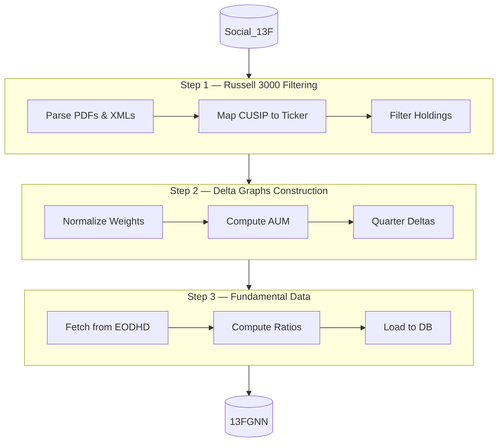

# Preprocessing Pipeline — Stock Market Social Network

This folder contains the three-stage ETL pipeline that transforms raw SEC 13F filings into a graph-ready PostgreSQL database used for training the GNN model.

## Data Flow



## Folder Structure

```
preprocess/
├── step1_russell3000_filtering/    # Russell 3000 index parsing & SEC holdings filter
│   ├── indices_parser/             # 8-step sub-pipeline (parse → price)
│   ├── filterholdings/             # Filter holdings to valid Russell 3000 CUSIPs
│   ├── russell/                    # Legacy CUSIP reference notebook
│   ├── config.py                   # DB names, quarters, API config
│   └── run_full_pipeline.py        # Entry point for steps 1–2
│
├── step2_delta_graphs/             # Normalized holdings & portfolio delta metrics
│   ├── steps/                      # step1–step8 (create DB → changed_stas)
│   ├── pipeline.py                 # Orchestrator
│   ├── db_connector.py             # PostgreSQL handler
│   └── run_pipeline.py             # CLI entry point
│
├── step3_fundamental_data/         # Fundamental data ingestion via EODHD API
│   └── Insert_Fundamentaldata.ipynb
│
├── analysis_notebooks/             # Exploratory & diagnostic notebooks
│   ├── changed_holdings_quarterly_stats.ipynb
│   ├── load_quarter_to_neo4j.ipynb
│   └── filtering cik/
│
└── run_pipeline.py                 # Top-level entry point (delegates to ETL)
```

## Prerequisites

- Python 3.10+
- PostgreSQL (source DB `Social_13F` must exist and be populated)
- EODHD API key (for prices, fundamentals, trading dates)

## Environment Variables

Create a `.env` file in the repo root (never commit it):

```
DB_HOST=localhost
DB_PORT=5432
DB_USER=your_user
DB_PASSWORD=your_password
EDOHD_API=your_eodhd_api_key
```

## Setup

```bash
pip install -r requirements.txt
```

## Running the Pipeline

### Step 1 — Russell 3000 Filtering

Parses Russell 3000 index files (PDF 2013–2018, XML 2019–2025), maps CUSIPs to tickers via EODHD, and filters the SEC 13F holdings table to valid Russell 3000 securities.

```bash
cd preprocess
python step1_russell3000_filtering/run_full_pipeline.py
```

Sub-steps inside `indices_parser/`:

| Step | What it does |
|------|-------------|
| 1 | Parse PDF/XML Russell files → CSV |
| 2 | Fill missing CUSIPs from SEC DB |
| 3 | Map CUSIP → Ticker (reference file + EODHD) |
| 4 | Remove records without CUSIP or Ticker |
| 5 | Deduplicate (keep oldest year per company) |
| 6 | Query EODHD for trading start/end dates |
| 7 | Filter out securities inactive before 2013 |
| 8 | Extract quarter-end prices via EODHD |

**Output table:** `holdings_filtered_new` in `Social_13F`

### Step 2 — Delta Graphs Construction

Reads filtered holdings and builds normalized portfolio weights, AUM metrics, and quarter-over-quarter delta features.

```bash
python step2_delta_graphs/run_pipeline.py
```

| Table created | Description |
|---------------|-------------|
| `stocks_return` | Quarterly price return per CUSIP |
| `normalized_holdings` | Portfolio weights per (CIK, CUSIP, quarter) |
| `cik_aum` | Total AUM per fund per quarter |
| `changed_holdings` | Δshares, Δweight, Δadjusted-weight per quarter |
| `changed_stas` | Graph statistics + return tertiles per quarter |

**Output DB:** `13FGNN`

### Step 3 — Fundamental Data Extraction

Fetches company fundamentals (P/E, ROE, EV/EBITDA, etc.) from EODHD and loads them into the graph database.

Open and run all cells in:
```
step3_fundamental_data/Insert_Fundamentaldata.ipynb
```

**Output table:** `cusip_financial_data` in `13FGNN`

## Key Identifiers

| Identifier | Description | Example |
|-----------|-------------|---------|
| `CIK` | SEC fund identifier | `1325091` |
| `CUSIP` | 9-char security identifier | `037833100` |
| `TICKER` | Stock symbol | `AAPL` |

## Source Data

Raw Russell 3000 index files live in `../Data/Indexes/RUSSELL3000 HISTORY/`:
- PDFs: 2013–2018
- XMLs: 2019–2025
